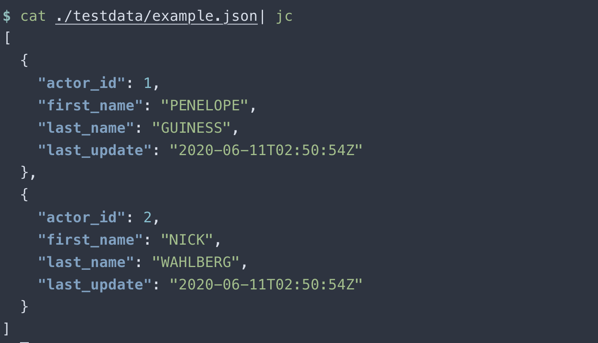

[](https://github.com/neilotoole/jsoncolor/actions?query=workflow%3AGo)
[](https://goreportcard.com/report/neilotoole/jsoncolor)
[](https://github.com/neilotoole/jsoncolor/releases/tag/v0.7.0)
[](https://pkg.go.dev/github.com/neilotoole/jsoncolor)
[](./LICENSE)

# jsoncolor

Package `neilotoole/jsoncolor` is a drop-in replacement for stdlib
[`encoding/json`](https://pkg.go.dev/encoding/json) that outputs colorized JSON.

Why? Well, [`jq`](https://jqlang.github.io/jq/) colorizes its output by default, and color output
is desirable for many Go CLIs. This package performs colorization (and indentation) inline
in the encoder, and is significantly faster than stdlib at indentation.

From the example [`jc`](./cmd/jc/main.go) app:



## Usage

Get the package per the normal mechanism (requires Go 1.17+):

```shell
go get -u github.com/neilotoole/jsoncolor
```

Then:

```go
package main

import (
  "fmt"
  "github.com/mattn/go-colorable"
  json "github.com/neilotoole/jsoncolor"
  "os"
)

func main() {
  var enc *json.Encoder

  // Note: this check will fail if running inside Goland (and
  // other IDEs?) as IsColorTerminal will return false.
  if json.IsColorTerminal(os.Stdout) {
    // Safe to use color
    out := colorable.NewColorable(os.Stdout) // needed for Windows
    enc = json.NewEncoder(out)

    // DefaultColors are similar to jq
    clrs := json.DefaultColors()

    // Change some values, just for fun
    clrs.Bool = json.Color("\x1b[36m") // Change the bool color
    clrs.String = json.Color{}         // Disable the string color

    enc.SetColors(clrs)
  } else {
    // Can't use color; but the encoder will still work
    enc = json.NewEncoder(os.Stdout)
  }

  m := map[string]interface{}{
    "a": 1,
    "b": true,
    "c": "hello",
  }

  if err := enc.Encode(m); err != nil {
    fmt.Fprintln(os.Stderr, err)
    os.Exit(1)
  }
}
```

### Configuration

To enable colorization, invoke [`enc.SetColors`](https://pkg.go.dev/github.com/neilotoole/jsoncolor#Encoder.SetColors).

The [`Colors`](https://pkg.go.dev/github.com/neilotoole/jsoncolor#Colors) struct
holds color config. The zero value and `nil` are both safe for use (resulting in no colorization).

The [`DefaultColors`](https://pkg.go.dev/github.com/neilotoole/jsoncolor#DefaultColors) func
returns a `Colors` struct that produces results similar to `jq`:

```go
// DefaultColors returns the default Colors configuration.
// These colors largely follow jq's default colorization,
// with some deviation.
func DefaultColors() *Colors {
  return &Colors{
    Null:   Color("\x1b[2m"),
    Bool:   Color("\x1b[1m"),
    Number: Color("\x1b[36m"),
    String: Color("\x1b[32m"),
    Key:    Color("\x1b[34;1m"),
    Bytes:  Color("\x1b[2m"),
    Time:   Color("\x1b[32;2m"),
    Punc:   Color{}, // No colorization
  }
}
```

As seen above, use the `Color` zero value (`Color{}`) to
disable colorization for that JSON element.

### Helper for `fatih/color`

It can be inconvenient to use terminal codes, e.g. `json.Color("\x1b[36m")`.
A helper package provides an adapter for [`fatih/color`](https://github.com/fatih/color).

```go
  // import "github.com/neilotoole/jsoncolor/helper/fatihcolor"
  // import "github.com/fatih/color"
  // import "github.com/mattn/go-colorable"
  
  out := colorable.NewColorable(os.Stdout) // needed for Windows
  enc = json.NewEncoder(out)
  
  fclrs := fatihcolor.DefaultColors()
  // Change some values, just for fun
  fclrs.Number = color.New(color.FgBlue)
  fclrs.String = color.New(color.FgCyan)
  
  clrs := fatihcolor.ToCoreColors(fclrs)
  enc.SetColors(clrs)
```

### Drop-in for `encoding/json`

This package is a full drop-in for stdlib [`encoding/json`](https://pkg.go.dev/encoding/json)
(thanks to the ancestral [`segmentio/encoding/json`](https://pkg.go.dev/github.com/segmentio/encoding/json)
pkg being a full drop-in).

To drop-in, just use an import alias:

```go
  import json "github.com/neilotoole/jsoncolor"
```

## Example app: `jc`

See [`cmd/jc`](cmd/jc/main.go) for a trivial CLI implementation that can accept JSON input,
and output that JSON in color.

```shell
# From project root
$ go install ./cmd/jc
$ cat ./testdata/sakila_actor.json | jc
```

## Benchmarks

Note that this package contains [`golang_bench_test.go`](./golang_bench_test.go), which
is inherited from `segmentj`. But here we're interested in [`benchmark_test.go:BenchmarkEncode`](./benchmark_test.go),
which benchmarks encoding performance versus other JSON encoder packages.
The results below benchmark the following:

- Stdlib [`encoding/json`](https://pkg.go.dev/encoding/json) (`go1.17.1`).
- [`segmentj`](https://github.com/segmentio/encoding): `v0.1.14`, which was when `jsoncolor` was forked. The newer `segmentj` code performs even better.
- `neilotoole/jsoncolor`: (this package) `v0.6.0`.
- [`nwidger/jsoncolor`](https://github.com/nwidger/jsoncolor): `v0.3.0`, latest at time of benchmarks.

Note that two other Go JSON colorization packages ([`hokaccha/go-prettyjson`](https://github.com/hokaccha/go-prettyjson) and
[`TylerBrock/colorjson`](https://github.com/TylerBrock/colorjson)) are excluded from
these benchmarks because they do not provide a stdlib-compatible `Encoder` impl.

```
$ go test -bench=BenchmarkEncode -benchtime="5s"
goarch: amd64
pkg: github.com/neilotoole/jsoncolor
cpu: Intel(R) Core(TM) i9-9880H CPU @ 2.30GHz
BenchmarkEncode/stdlib_NoIndent-16                           181          33047390 ns/op         8870685 B/op     120022 allocs/op
BenchmarkEncode/stdlib_Indent-16                             124          48093178 ns/op        10470366 B/op     120033 allocs/op
BenchmarkEncode/segmentj_NoIndent-16                         415          14658699 ns/op         3788911 B/op      10020 allocs/op
BenchmarkEncode/segmentj_Indent-16                           195          30628798 ns/op         5404492 B/op      10025 allocs/op
BenchmarkEncode/neilotoole_NoIndent_NoColor-16               362          16522399 ns/op         3789034 B/op      10020 allocs/op
BenchmarkEncode/neilotoole_Indent_NoColor-16                 303          20146856 ns/op         5460753 B/op      10021 allocs/op
BenchmarkEncode/neilotoole_NoIndent_Color-16                 295          19989420 ns/op        10326019 B/op      10029 allocs/op
BenchmarkEncode/neilotoole_Indent_Color-16                   246          24714163 ns/op        11996890 B/op      10030 allocs/op
BenchmarkEncode/nwidger_NoIndent_NoColor-16                   10         541107983 ns/op        92934231 B/op    4490210 allocs/op
BenchmarkEncode/nwidger_Indent_NoColor-16                      7         798088086 ns/op        117258321 B/op   6290213 allocs/op
BenchmarkEncode/nwidger_indent_NoIndent_Colo-16               10         542002051 ns/op        92935639 B/op    4490224 allocs/op
BenchmarkEncode/nwidger_indent_Indent_Color-16                 7         799928353 ns/op        117259195 B/op   6290220 allocs/op
```

As always, take benchmarks with a large grain of salt, as they're based on a (small) synthetic benchmark.
More benchmarks would give a better picture (and note as well that the benchmarked `segmentj` is an older version, `v0.1.14`).

All that having been said, what can we surmise from these particular results?

- `segmentj` performs better than `stdlib` at all encoding tasks.
- `jsoncolor` performs better than `segmentj` for indentation (which makes sense, as indentation is performed inline).
- `jsoncolor` performs better than `stdlib` at all encoding tasks.

Again, trust these benchmarks at your peril. Create your own benchmarks for your own workload.

## Notes

- The [`.golangci.yml`](./.golangci.yml) linter settings have been fiddled with to hush some
  linting issues inherited from the `segmentio` codebase at the time of forking. Thus, the linter report
  may not be of great use. In an ideal world, the `jsoncolor` functionality would be [ported](https://github.com/neilotoole/jsoncolor/issues/15) to a
  more recent (and better-linted) version of the `segementio` codebase.
- The `segmentio` encoder (at least as of `v0.1.14`) encodes `time.Duration` as string, while `stdlib` outputs as `int64`.
  This package follows `stdlib`.
- The [`Colors.Punc`](https://pkg.go.dev/github.com/neilotoole/jsoncolor#Colors) field controls all
  punctuation colorization, i.e. `[]{},:"`. It is probably worthwhile to [separate](https://github.com/neilotoole/jsoncolor/issues/16)
  these out into individually-configurable elements.

<a name="history"></a>
## CHANGELOG

History: this package is an extract of [`sq`](https://github.com/neilotoole/sq)'s JSON encoding package, which itself is a fork of the
[`segmentio/encoding`](https://github.com/segmentio/encoding) JSON encoding package. Note that the
original `sq` JSON encoder was forked from Segment's codebase at `v0.1.14`, so
the codebases have drifted significantly by now.

### [v0.7.2](https://github.com/neilotoole/jsoncolor/releases/tag/v0.7.2)

- [#38](https://github.com/neilotoole/jsoncolor/issues/38): Fix `TestCodec` failure on Go 1.22+ and update CI.
  - Use semantic JSON comparison in `TestCodec` to handle stdlib escape sequence changes.
  - Bump minimum Go version from 1.16 to 1.17.
  - Update CI workflows: expand test matrix to Go 1.17/1.24/1.26, fix `golangci-lint` workflow.

### [v0.7.1](https://github.com/neilotoole/jsoncolor/releases/tag/v0.7.1)

- [#27](https://github.com/neilotoole/jsoncolor/pull/27): Improved Windows terminal color support checking.

### [v0.7.0](https://github.com/neilotoole/jsoncolor/releases/tag/v0.7.0)

- [#21](https://github.com/neilotoole/jsoncolor/pull/21): Support for [`encoding.TextMarshaler`](https://pkg.go.dev/encoding#TextMarshaler).
- [#22](https://github.com/neilotoole/jsoncolor/pull/22): Removed redundant dependencies.
- [#26](https://github.com/neilotoole/jsoncolor/pull/26): Updated dependencies.

## Acknowledgments

- [`jq`](https://stedolan.github.io/jq/): sine qua non.
- [`segmentio/encoding`](https://github.com/segmentio/encoding): `jsoncolor` is layered into Segment's JSON encoder. They did the hard work. Much gratitude to that team.
- [`sq`](https://github.com/neilotoole/sq): `jsoncolor` is effectively an extract of code created specifically for `sq`.
- [`mattn/go-colorable`](https://github.com/mattn/go-colorable): no project is complete without `mattn` having played a role.
- [`fatih/color`](https://github.com/fatih/color): the color library.
- [`@hermannm`](https://github.com/hermannm): for several PRs.

### Related

- [`nwidger/jsoncolor`](https://github.com/nwidger/jsoncolor)
- [`hokaccha/go-prettyjson`](https://github.com/hokaccha/go-prettyjson)
- [`TylerBrock/colorjson`](https://github.com/TylerBrock/colorjson)
