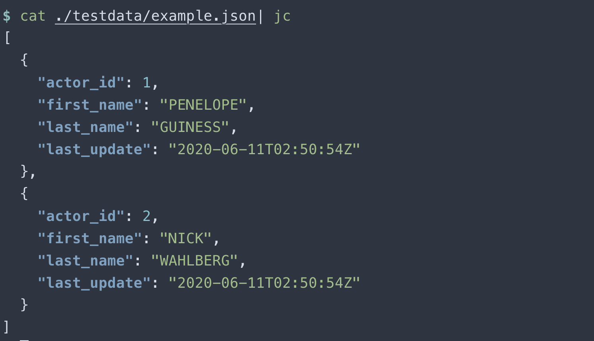

[](https://github.com/neilotoole/jsoncolor/actions?query=workflow%3AGo)
[](https://goreportcard.com/report/neilotoole/jsoncolor)
[](https://github.com/neilotoole/jsoncolor#v0101)
[](https://pkg.go.dev/github.com/neilotoole/jsoncolor)
[](./LICENSE)

# jsoncolor

Package `neilotoole/jsoncolor` is a drop-in replacement for the standard library's
[`encoding/json`](https://pkg.go.dev/encoding/json) that emits colorized JSON, in the
style of [`jq`](https://jqlang.github.io/jq/).

Colorization and indentation are performed inline in the encoder, in a single pass over
the value, which makes indented output faster than indenting with `encoding/json` (see
[Benchmarks](#benchmarks)). Color is opt-in per `Encoder`, honors `NO_COLOR` and
`FORCE_COLOR`, and works on Windows via
[`mattn/go-colorable`](https://github.com/mattn/go-colorable).

From the example [`jc`](./cmd/jc/main.go) app:



## Usage

Get the package per the normal mechanism (requires Go 1.25+):

```shell
go get -u github.com/neilotoole/jsoncolor
```

Then:

```go
package main

import (
  "fmt"
  "github.com/mattn/go-colorable"
  json "github.com/neilotoole/jsoncolor"
  "os"
)

func main() {
  var enc *json.Encoder

  // IsColorTerminal reports false when stdout is not a terminal,
  // e.g. when piped or redirected, or in an IDE run console.
  if json.IsColorTerminal(os.Stdout) {
    // Safe to use color
    out := colorable.NewColorable(os.Stdout) // needed for Windows
    enc = json.NewEncoder(out)

    // DefaultColors are similar to jq
    clrs := json.DefaultColors()

    // Change some values, just for fun
    clrs.Bool = json.Color("\x1b[36m") // Change the bool color
    clrs.String = json.Color{}         // Disable the string color

    enc.SetColors(clrs)
  } else {
    // Can't use color; but the encoder will still work
    enc = json.NewEncoder(os.Stdout)
  }

  m := map[string]any{
    "a": 1,
    "b": true,
    "c": "hello",
  }

  if err := enc.Encode(m); err != nil {
    fmt.Fprintln(os.Stderr, err)
    os.Exit(1)
  }
}
```

## Configuration

To enable colorization, invoke [`enc.SetColors`](https://pkg.go.dev/github.com/neilotoole/jsoncolor#Encoder.SetColors).

The [`Colors`](https://pkg.go.dev/github.com/neilotoole/jsoncolor#Colors) struct
holds color config. The zero value and `nil` are both safe for use (resulting in no colorization).

The [`DefaultColors`](https://pkg.go.dev/github.com/neilotoole/jsoncolor#DefaultColors) func
returns a `Colors` struct that produces results similar to `jq`:

```go
// DefaultColors returns the default Colors configuration.
// These colors largely follow jq's default colorization,
// with some deviation.
func DefaultColors() *Colors {
  return &Colors{
    Null:   Color("\x1b[2m"),
    Bool:   Color("\x1b[1m"),
    Number: Color("\x1b[36m"),
    String: Color("\x1b[32m"),
    Key:    Color("\x1b[34;1m"),
    Bytes:  Color("\x1b[2m"),
    Time:   Color("\x1b[32;2m"),
    Punc:   Color{}, // No colorization
    // The granular punctuation fields (Brackets, Braces, Comma,
    // Colon) are intentionally left as the zero value so that they
    // fall back to Punc, preserving the default (uncolored)
    // punctuation behavior.
    TextMarshaler: Color("\x1b[32m"), // Same as String
  }
}
```

As seen above, use the `Color` zero value (`Color{}`) to
disable colorization for that JSON element.

### Punctuation

[`Colors.Punc`](https://pkg.go.dev/github.com/neilotoole/jsoncolor#Colors) is the
fallback color for punctuation (`[]{},:`). The individual classes can also be set via
`Colors.Brackets`, `Colors.Braces`, `Colors.Comma`, and `Colors.Colon`, each falling back
to `Colors.Punc` when unset. The structural `"` around strings and keys is colored by
`Colors.String` and `Colors.Key`, not `Colors.Punc`.

### Color reset

`Color` is the prefix only. The encoder closes every colorized token with the
fixed sequence `\x1b[0m` (SGR 0), and there is no way for a caller to supply a
different closer.

`\x1b[0m` resets *every* terminal attribute, not just the ones the prefix set.
That is the safe default: no attribute can leak out of a token. The trade-off is
composability. jsoncolor output is not safe to nest inside a region that is
already styled, because the first colorized token clears that styling for the
remainder of the output. Rendering colorized JSON inside a diff line that has a
background color, inside a TUI panel with an inherited style, or after a styled
log prefix will each drop the surrounding style.

An attribute-specific closer (`\x1b[39m` for "default foreground", `\x1b[22m`
for "normal intensity", and so on) would leave untouched attributes alone, but
jsoncolor cannot compute one. `Color` arrives as already-rendered opaque bytes,
so given `\x1b[34;1m` the encoder has no way to know that those parameters mean
blue and bold. See [#75](https://github.com/neilotoole/jsoncolor/issues/75) for
the full analysis, including the API options if this is ever addressed.

### Detecting color support

[`IsColorTerminal`](https://pkg.go.dev/github.com/neilotoole/jsoncolor#IsColorTerminal)
reports whether a writer is a terminal that can display color. It checks `NO_COLOR`, then
`FORCE_COLOR`, then `TERM=dumb`, and finally whether the writer is a terminal. It returns
false whenever output is piped or redirected, which is the desired behavior: escape codes
should not end up in a file or in a downstream program. Set `FORCE_COLOR` to colorize
anyway, e.g. when piping to a pager that renders escape codes (`jc | less -R`).

`IsColorTerminal` likewise returns false in an IDE's run-configuration console, which is not
a terminal at all: it does not set `TERM`, and is a pipe rather than a TTY. In JetBrains IDEs,
ticking *Emulate terminal in output console* in the run configuration gives the process a real
terminal, and color then works. An IDE's embedded terminal, such as GoLand's Terminal tool
window, is already a real terminal and needs nothing.

On Windows, `IsColorTerminal` also enables virtual terminal processing on the console. The
usage example additionally wraps stdout with
[`colorable.NewColorable`](https://pkg.go.dev/github.com/mattn/go-colorable#NewColorable),
which translates escape codes for Windows consoles that do not process them natively.

### Helper for `fatih/color`

It can be inconvenient to use terminal codes, e.g. `json.Color("\x1b[36m")`.
A helper package provides an adapter for [`fatih/color`](https://github.com/fatih/color).

```go
  // import "github.com/neilotoole/jsoncolor/helper/fatihcolor"
  // import "github.com/fatih/color"
  // import "github.com/mattn/go-colorable"
  
  out := colorable.NewColorable(os.Stdout) // needed for Windows
  enc = json.NewEncoder(out)
  
  fclrs := fatihcolor.DefaultColors()
  // Change some values, just for fun
  fclrs.Number = color.New(color.FgBlue)
  fclrs.String = color.New(color.FgCyan)
  
  clrs := fatihcolor.ToCoreColors(fclrs)
  enc.SetColors(clrs)
```

## Relationship to `encoding/json`

This package is a full drop-in for [`encoding/json`](https://pkg.go.dev/encoding/json),
a property inherited from the ancestral
[`segmentio/encoding/json`](https://pkg.go.dev/github.com/segmentio/encoding/json) package.
To drop in, alias the import:

```go
  import json "github.com/neilotoole/jsoncolor"
```

A few things are worth knowing:

- [`Marshal`](https://pkg.go.dev/github.com/neilotoole/jsoncolor#Marshal) and
  [`MarshalIndent`](https://pkg.go.dev/github.com/neilotoole/jsoncolor#MarshalIndent) are
  uncolored. Color reaches the encoder only through
  [`Encoder.SetColors`](https://pkg.go.dev/github.com/neilotoole/jsoncolor#Encoder.SetColors),
  or by calling the low-level
  [`Append`](https://pkg.go.dev/github.com/neilotoole/jsoncolor#Append) with a `*Colors`.
- `MarshalIndent` indents inline, in the same single pass as
  [`Encoder.SetIndent`](https://pkg.go.dev/github.com/neilotoole/jsoncolor#Encoder.SetIndent),
  rather than re-scanning compact output as `encoding/json` does. `Append` gets the same when
  passed an [`Indenter`](https://pkg.go.dev/github.com/neilotoole/jsoncolor#Indenter),
  constructed with [`NewIndenter`](https://pkg.go.dev/github.com/neilotoole/jsoncolor#NewIndenter).
  One subtlety, inherited from `encoding/json`: `MarshalIndent(v, "", "")` still breaks
  lines, whereas `Encoder.SetIndent("", "")` disables indentation.
- [`Encoder.SetSortMapKeys`](https://pkg.go.dev/github.com/neilotoole/jsoncolor#Encoder.SetSortMapKeys)
  toggles map key sorting, which `encoding/json` always performs and which is on by default
  here too.
  [`Encoder.SetTrustRawMessage`](https://pkg.go.dev/github.com/neilotoole/jsoncolor#Encoder.SetTrustRawMessage)
  skips validation of `RawMessage` values known to be valid JSON, e.g. because they came
  from `Unmarshal`. Both are inherited from `segmentio/encoding`.
- `time.Duration` encodes as its `int64` nanosecond count, matching `encoding/json`.
  `segmentio/encoding` encodes it as a string (`"3s"`); this package does not follow it.

## Example app: `jc`

See [`cmd/jc`](cmd/jc/main.go) for a trivial CLI implementation that can accept JSON input,
and output that JSON in color.

```shell
# From project root
$ go install ./cmd/jc
$ cat ./testdata/sakila_actor.json | jc
```

## Benchmarks

[`benchmark_test.go:BenchmarkEncode`](./benchmark_test.go) encodes 10,000 rows of mixed
scalar values, each also carrying the decoded `testdata/sakila_actor.json` document, with
four encoders:

- Stdlib [`encoding/json`](https://pkg.go.dev/encoding/json).
- [`segmentio/encoding`](https://github.com/segmentio/encoding) `v0.5.4`, the upstream this
  package is forked from (as `segmentj`).
- `neilotoole/jsoncolor` (this package) `v0.10.0`, with and without color.
- [`nwidger/jsoncolor`](https://github.com/nwidger/jsoncolor) `v0.3.2`.

Two other Go JSON colorization packages,
[`hokaccha/go-prettyjson`](https://github.com/hokaccha/go-prettyjson) and
[`TylerBrock/colorjson`](https://github.com/TylerBrock/colorjson), are excluded because
they do not provide a stdlib-compatible `Encoder`.

Apple M1 Max, Go 1.26.5, `-benchtime=2s -count=10`, summarized by
[`benchstat`](https://pkg.go.dev/golang.org/x/perf/cmd/benchstat). Rows are named by
sub-benchmark, without the `Encode/` prefix and `-10` GOMAXPROCS suffix. Variation across the
ten runs was within 2% on every row and is omitted. `vs stdlib` is the change in `sec/op`
relative to the `encoding/json` row with the same indentation setting; negative is faster.

| Benchmark | sec/op | vs stdlib | B/op | allocs/op |
|---|---:|---:|---:|---:|
| `stdlib_NoIndent` | 9.663m | — | 6.061Mi | 70.02k |
| `stdlib_Indent` | 16.53m | — | 8.058Mi | 70.03k |
| `segmentj_NoIndent` | 4.991m | −48.3% | 4.232Mi | 10.02k |
| `segmentj_Indent` | 11.39m | −31.1% | 3.226Mi | 10.02k |
| `neilotoole_NoIndent_NoColor` | 5.245m | −45.7% | 4.232Mi | 10.02k |
| `neilotoole_Indent_NoColor` | 6.066m | −63.3% | 6.225Mi | 10.02k |
| `neilotoole_NoIndent_Color` | 5.921m | −38.7% | 8.232Mi | 10.03k |
| `neilotoole_Indent_Color` | 6.932m | −58.1% | 10.23Mi | 10.03k |
| `nwidger_NoIndent_NoColor` | 102.5m | +960.7% | 55.08Mi | 2.270M |
| `nwidger_Indent_NoColor` | 123.7m | +648.3% | 59.96Mi | 2.700M |
| `nwidger_NoIndent_Color` | 103.8m | +974.2% | 55.08Mi | 2.270M |
| `nwidger_Indent_Color` | 123.7m | +648.3% | 59.96Mi | 2.700M |

What these particular results say:

- Indentation is where the inline approach pays off. jsoncolor's indented output is 2.7×
  faster than `encoding/json`'s and 1.9× faster than the segmentio upstream's, both of which
  indent in a second pass. Indenting adds 16% to jsoncolor's compact time, against 71% for
  `encoding/json` and 128% for segmentio.
- Compact, uncolored output runs about 5% behind the segmentio upstream, which is the cost of
  the color-capable walk. It is still 1.8× faster than `encoding/json`, with a seventh of the
  allocations.
- Color adds 13–14% and about ten allocations.
- `nwidger/jsoncolor` is roughly 20× slower, with over 200× the allocations.

This is one synthetic document; benchmark your own workload. For a per-shape comparison
against the segmentio upstream, see `BenchmarkCmp` and the table in the
[v0.10.0](#v0100) changelog entry.

## Contributing

Contributions are welcome! See [`CONTRIBUTING.md`](CONTRIBUTING.md) for how to build,
test, and submit changes, and please follow the [Code of Conduct](CODE_OF_CONDUCT.md).
To report a security vulnerability, see [`SECURITY.md`](SECURITY.md).

<a name="history"></a>
## CHANGELOG

History: this package started as an extract of [`sq`](https://github.com/neilotoole/sq)'s JSON
encoding package, which itself was a fork of the
[`segmentio/encoding`](https://github.com/segmentio/encoding) JSON encoding package. Note that the
original `sq` JSON encoder was forked from Segment's codebase at `v0.1.14`, so
the codebases have drifted significantly by now.

### [v0.10.1](https://github.com/neilotoole/jsoncolor/releases/tag/v0.10.1)

`MarshalIndent` now indents inline, and the documentation is brought up to date.
There are no exported API changes and no change to encoder output.

#### Changed

- [#77](https://github.com/neilotoole/jsoncolor/issues/77): `MarshalIndent` now indents inline, using the same `Indenter` as `Encoder.SetIndent`, instead of marshaling compact and re-indenting the result with `Indent`. Output is byte-identical to before, including `MarshalIndent(v, "", "")`, which keeps `encoding/json`'s line-breaking behavior rather than the `Encoder`'s disable-on-empty rule; `TestMarshalIndent_Parity` pins it against the previous algorithm across the encode corpus. Measured with `BenchmarkMarshalIndent` on an Apple M1 Max under Go 1.26.5 (`-count=10`, benchstat): 59% faster on the decoded `sakila_actor.json` document and 50% faster on a slice of 1,000 synthetic records, allocating about half the bytes.
- [#75](https://github.com/neilotoole/jsoncolor/issues/75): The fixed ANSI reset that closes every colorized token is now documented, on `Color` and `Colors` and in a README "Color reset" section: why output is not safe to nest inside an already-styled region, and why an attribute-specific closer cannot be computed from an opaque prefix. Documentation only.
- [#78](https://github.com/neilotoole/jsoncolor/pull/78): README overhaul. The stale caveat that `IsColorTerminal` "will fail inside Goland" is replaced, in the README and both examples, with the actual condition: stdout is not a terminal. The 2021 benchmark table is regenerated on current hardware and Go; the Notes section is dissolved into Punctuation, Detecting color support, and a new "Relationship to `encoding/json`" section; and the dead linter/porting note is removed.

### [v0.10.0](https://github.com/neilotoole/jsoncolor/releases/tag/v0.10.0)

Encoder correctness fixes, a fast path for uncolored output, a performance
pass against the segmentio upstream, and a stricter CI test run. There are no
exported API changes. The minor version bump signals that several of the
fixes change output at the byte level, so stored fixtures may need
regenerating; in particular, colored output from a partially populated
palette changes (see [#54](https://github.com/neilotoole/jsoncolor/issues/54)),
though nothing visible changes on a terminal.

- [#73](https://github.com/neilotoole/jsoncolor/pull/73): Backspace and form feed in strings are now written as `\b` and `\f` instead of `\u0008` and `\u000c`. This matches `encoding/json` since [Go 1.22](https://go.dev/doc/go1.22#encoding/json), which made the same change; this package had kept the older spelling. Both forms decode to the same bytes, so nothing changes semantically, but output containing either character differs byte-for-byte from earlier releases. Anything that compares encoder output against stored fixtures, golden files or checksums may need those regenerated.
- [#44](https://github.com/neilotoole/jsoncolor/issues/44): Fast-path the encode walk when no colors and no indenter are set, skipping the per-token nil-receiver dispatch. Output is byte-identical to the general walk, enforced by a parity test that also covers error paths.
- [#53](https://github.com/neilotoole/jsoncolor/issues/53): `Colors.TextMarshaler` falls back to `Colors.String` when unset, the same way the granular punctuation fields fall back to `Colors.Punc`. Previously an unset field produced an uncolored token followed by a stray ANSI reset.
- [#54](https://github.com/neilotoole/jsoncolor/issues/54): An empty `Color` now emits neither a prefix nor a reset, as the `Color` docs always promised. `&Colors{}` produces output identical to a nil palette, and `DefaultColors()` no longer emits a reset after every punctuation mark.
- [#56](https://github.com/neilotoole/jsoncolor/issues/56): A nil embedded struct pointer no longer leaves a double or trailing comma behind, and an indented struct whose every field is omitted encodes as `{}`, matching `encoding/json`.
- [#58](https://github.com/neilotoole/jsoncolor/issues/58): A failed `Encode` no longer leaks indenter depth into later `Encode` calls on the same `Encoder`.
- [#59](https://github.com/neilotoole/jsoncolor/issues/59): `omitempty` on a field promoted through an embedded struct pointer is evaluated on the promoted field, not on the pointer word. Previously zero-valued fields were emitted, and with the embedded pointer as the last field the check could read past the end of the struct.
- [#62](https://github.com/neilotoole/jsoncolor/issues/62): `map[string]RawMessage` with an invalid value now returns an error when map keys are unsorted instead of silently emitting invalid JSON. All map branches now roll the output buffer back to its entry length on error.
- CI runs the test suite under the race detector as well, which enables `checkptr` and would have caught the out-of-bounds read fixed in #59.
- [#65](https://github.com/neilotoole/jsoncolor/pull/65): Updated dependencies: `mattn/go-colorable` v0.1.15, `golang.org/x/sys` v0.47.0, and `golang.org/x/term` v0.45.0 (plus test-only `stretchr/testify` v1.12.1).
- [#66](https://github.com/neilotoole/jsoncolor/issues/66): A trusted `RawMessage` that is not well-formed JSON no longer leaks indenter depth into later `Encode` calls. End of input inside a container is now reported as a syntax error internally, so the verbatim fallback starts from a clean depth.
- [#67](https://github.com/neilotoole/jsoncolor/issues/67): A nil `[]byte` is now a single null token colored by `Colors.Null`, instead of a null nested inside the `Colors.Bytes` prefix with two resets.
- [#70](https://github.com/neilotoole/jsoncolor/issues/70): Fields promoted through an embedded struct pointer are skipped before anything is written when the pointer is nil, replacing the write-then-truncate rollback. No behavior change.
- [#73](https://github.com/neilotoole/jsoncolor/pull/73): Encoder performance. Strings are scanned for escapes eight bytes at a time and copied whole when clean; integers use a dedicated base-10 formatter; `map[string]string`, `map[string]bool` and `map[string][]string` no longer go through reflect and encode with zero allocations; struct member prefixes are precomputed; and the colorized walk decides indentation once per container. A per-shape head-to-head benchmark against the segmentio upstream, `BenchmarkCmp`, is included.

Taken together, the changes in this release alter encode time against v0.9.1 as follows, measured with `BenchmarkCmp` on an Apple M1 Max (Go 1.26, interleaved runs, benchstat). The colorless and colored columns use a nil palette and `DefaultColors()` respectively. The segmentio upstream reference cells did not move.

| Shape                                | Colorless              | Colored |
|--------------------------------------|------------------------|---------|
| `[]string`, 43-byte ASCII            | -65%                   | -64%    |
| `map[string]string`                  | -61% (101 allocs to 0) | -59%    |
| `[]int`                              | -24%                   | -22%    |
| `[]struct`                           | -21%                   | -25%    |
| `[]string`, short                    | -13%                   | -21%    |
| `[][]any` rows of mixed values       | -14%                   | -19%    |
| Decoded Sakila JSON document (`any`) | -15%                   | -19%    |
| `map[string]any`                     | -9%                    | -14%    |
| `[]string` with escapes              | -7%                    | -10%    |
| `[]float64`                          | -3%                    | -5%     |
| `[]string`, non-ASCII                | no change              | -6%     |

`BenchmarkCodeEncoder`, the large struct document from the Go standard library's tests, is 25% faster. Across all encode benchmarks the geomean improvement is 18%.

### [v0.9.1](https://github.com/neilotoole/jsoncolor/releases/tag/v0.9.1)

Documentation and repository housekeeping; no functional changes to the library.

- Add a package doc comment so [pkg.go.dev](https://pkg.go.dev/github.com/neilotoole/jsoncolor) shows a package overview.
- Add `CONTRIBUTING.md`, a Contributor Covenant `CODE_OF_CONDUCT.md`, and GitHub issue and pull request templates.
- Refresh `SECURITY.md`: update supported versions and switch to private vulnerability reporting.
- Restrict the CI workflows' `GITHUB_TOKEN` to least-privilege (`contents: read`) permissions.
- README: add Contributing and License sections, and point the release badge at the changelog.

### [v0.9.0](https://github.com/neilotoole/jsoncolor/releases/tag/v0.9.0)

- [#16](https://github.com/neilotoole/jsoncolor/issues/16): Add individually-configurable punctuation color fields — `Colors.Brackets`, `Colors.Braces`, `Colors.Comma`, and `Colors.Colon` — each falling back to `Colors.Punc` when unset, so existing configs are unaffected.
- [#19](https://github.com/neilotoole/jsoncolor/issues/19): Fix nondeterministic object key order when encoding `RawMessage`. Values are now re-encoded via on-the-fly tokenization, preserving source key order, instead of round-tripping through a `map`.
- [#37](https://github.com/neilotoole/jsoncolor/issues/37): Exported the `indenter` type (now `Indenter`) and added the `NewIndenter` constructor, so external callers can construct the indenter argument accepted by `Append`. The `Append` signature now reads `Append(b []byte, x interface{}, flags AppendFlags, clrs *Colors, indentr *Indenter)`.

### [v0.8.0](https://github.com/neilotoole/jsoncolor/releases/tag/v0.8.0)

- Bumped minimum Go version from 1.17 to 1.25.
- Updated dependencies to latest: `fatih/color` v1.19.0, `mattn/go-colorable` v0.1.14, `golang.org/x/sys` v0.45.0, and `golang.org/x/term` v0.43.0 (plus test-only `stretchr/testify` v1.11.1 and `segmentio/encoding` v0.5.4).
- Migrated the `golangci-lint` config to the v2 format; CI now runs `golangci-lint` v2.12.2 (action `v8`) and the test matrix targets Go 1.25 and 1.26.
- Modernized internal code to satisfy the updated linters (e.g. `reflect.Ptr`→`reflect.Pointer`, `io/ioutil`→`io`, `unsafe.Slice`/`unsafe.StringData` for string/byte conversion). No behavior change.

### [v0.7.2](https://github.com/neilotoole/jsoncolor/releases/tag/v0.7.2)

- [#38](https://github.com/neilotoole/jsoncolor/issues/38): Fix `TestCodec` failure on Go 1.22+ and update CI.
  - Use semantic JSON comparison in `TestCodec` to handle stdlib escape sequence changes.
  - Bump minimum Go version from 1.16 to 1.17.
  - Update CI workflows: expand test matrix to Go 1.17/1.24/1.26, fix `golangci-lint` workflow.

### [v0.7.1](https://github.com/neilotoole/jsoncolor/releases/tag/v0.7.1)

- [#27](https://github.com/neilotoole/jsoncolor/pull/27): Improved Windows terminal color support checking.

### [v0.7.0](https://github.com/neilotoole/jsoncolor/releases/tag/v0.7.0)

- [#21](https://github.com/neilotoole/jsoncolor/pull/21): Support for [`encoding.TextMarshaler`](https://pkg.go.dev/encoding#TextMarshaler).
- [#22](https://github.com/neilotoole/jsoncolor/pull/22): Removed redundant dependencies.
- [#26](https://github.com/neilotoole/jsoncolor/pull/26): Updated dependencies.

## Acknowledgments

- [`jq`](https://jqlang.github.io/jq/): sine qua non.
- [`segmentio/encoding`](https://github.com/segmentio/encoding): `jsoncolor` is layered into Segment's JSON encoder. They did the hard work. Much gratitude to that team.
- [`sq`](https://github.com/neilotoole/sq): `jsoncolor` is effectively an extract of code created specifically for `sq`.
- [`mattn/go-colorable`](https://github.com/mattn/go-colorable): no project is complete without `mattn` having played a role.
- [`fatih/color`](https://github.com/fatih/color): the color library.
- [`@hermannm`](https://github.com/hermannm): for several PRs.

### Related

- [`nwidger/jsoncolor`](https://github.com/nwidger/jsoncolor)
- [`hokaccha/go-prettyjson`](https://github.com/hokaccha/go-prettyjson)
- [`TylerBrock/colorjson`](https://github.com/TylerBrock/colorjson)

## License

[MIT](LICENSE) © Neil O'Toole
